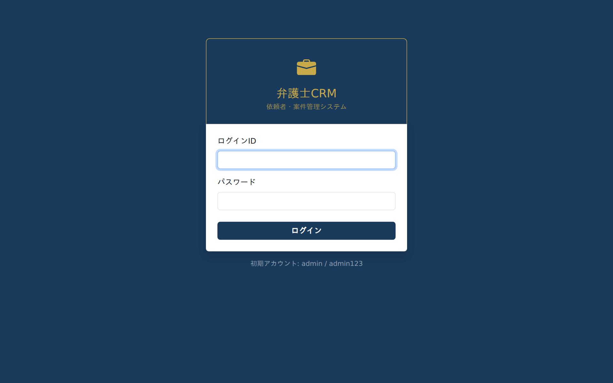
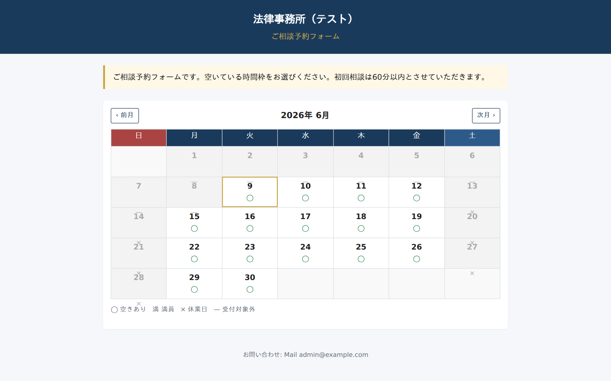
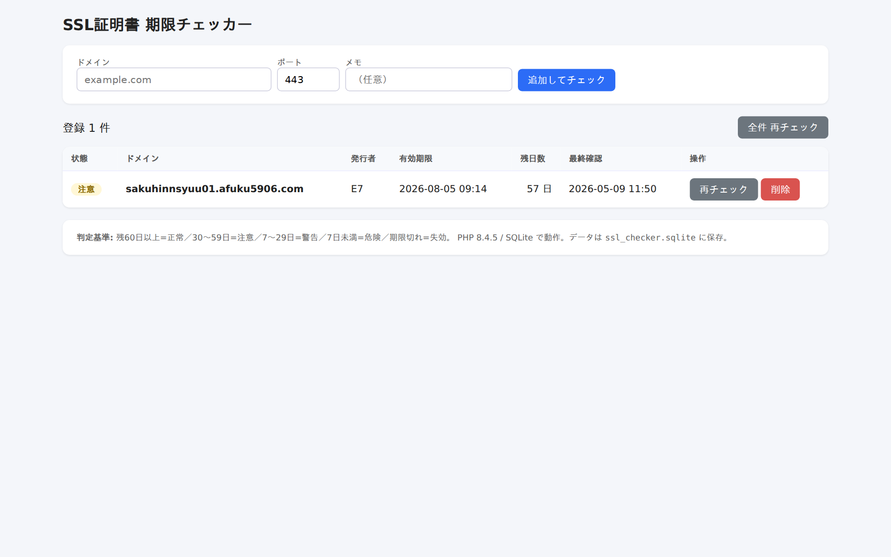
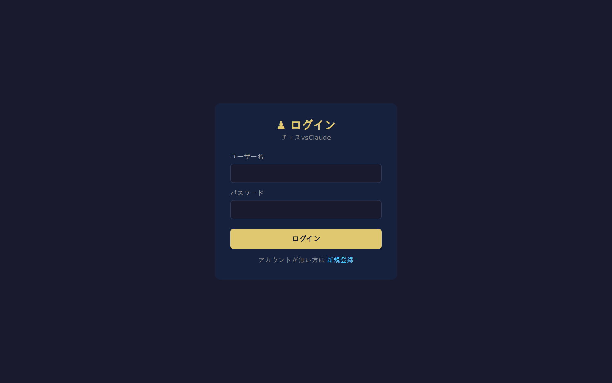
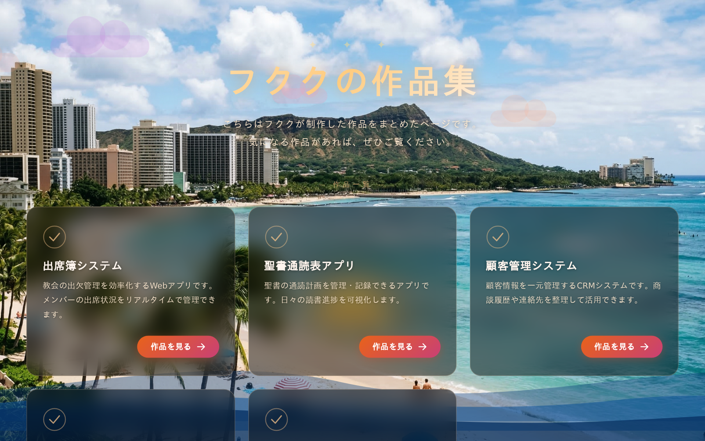
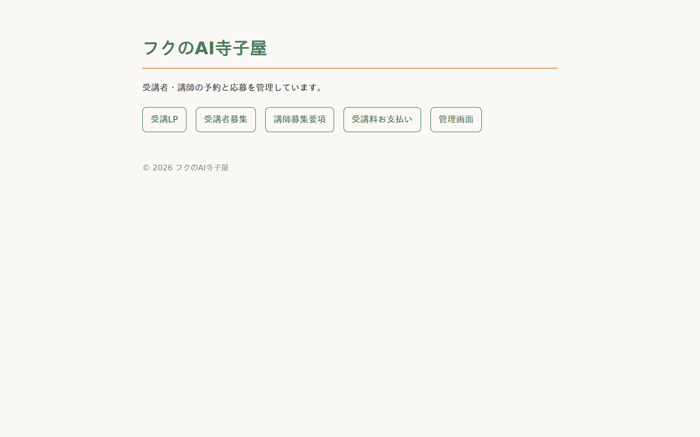
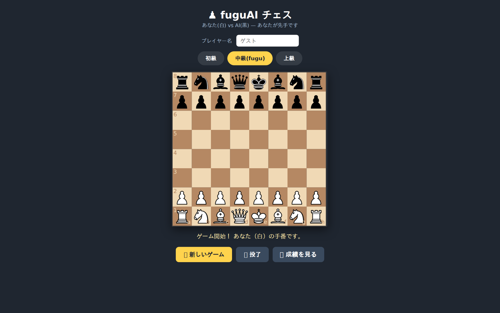

# ポートフォリオ — Webアプリケーション開発実績

PHP / MySQL を中心に、**実運用される業務Webアプリを約57件**自作・本番公開してきました。
CRM・予約管理・決済・AI連携・外部API連携まで、企画から実装・デプロイ・運用までを一人で担当しています。

- **GitHub**: https://github.com/AFukunaga06/vps_works （全制作物を公開中）
- **本番環境**: 自前のVPS（xserver-vps / Linux + Apache + MySQL）で常時稼働

---

## 📊 制作実績サマリー

| 指標 | 数値 |
|---|---|
| 制作したWebアプリ | **約57件**（すべて自作・本番稼働 or 公開） |
| 総コード行数 | **約 159,000 行**（PHP / Python / JavaScript） |
| PHPファイル数 | 641 |
| SQLスキーマ/マイグレーション | 102 |
| 開発・運用環境 | Linux VPS を自身で構築・SSL化・運用 |

---

## 🛠 技術スタック

| 分類 | 使用技術 |
|---|---|
| **言語** | PHP（メイン）, Python, JavaScript, SQL, HTML/CSS |
| **データベース** | MySQL（PDO + プリペアドステートメント）, スキーマ設計・マイグレーション |
| **決済** | Stripe（サブスクリプション・顧客ポータル・Webhook） |
| **外部API連携** | Google Calendar API（OAuth2.0）, Anthropic Claude API, LINE連携 |
| **メール** | PHPMailer / Gmail SMTP（予約確認・通知メール自動送信） |
| **インフラ** | Linux（Xserver VPS）, Apache, Let's Encrypt によるSSL化, cronによる自動バックアップ |
| **依存管理 / バージョン管理** | Composer, Git / GitHub |
| **AI活用** | Claude API による契約書のリスク分析・要約（Pythonマイクロサービス化） |

---

## 🔒 開発で徹底していること（セキュリティ・品質）

数を作るだけでなく、**実運用に耐える安全な実装**を意識しています。

| 観点 | 実装 | 適用ファイル数 |
|---|---|---|
| **SQLインジェクション対策** | PDO + プリペアドステートメントを徹底 | 316 |
| **CSRF対策** | トークン方式を全フォームに実装 | 119 |
| **パスワード保護** | `password_hash`（bcrypt）でハッシュ化保存 | 55 |
| **秘密情報の分離** | DB認証・APIキーを設定ファイル/環境変数に分離し、リポジトリから除外 | 全プロジェクト |
| **データ保全** | mysqldump によるDB自動バックアップ（cron）を各システムに実装 | 複数 |

---

## ⭐ 代表的な制作物

### 1. 士業向けCRM SaaS（`lawyer_crm`）— 最大規模・本番稼働中

弁護士・税理士・司法書士・行政書士の4業種に対応した顧客管理SaaS。

- **顧客・案件管理**、**見積（quotes）**、**契約書管理（contracts）** を一体化
- **Stripe決済**でサブスクリプション課金・顧客ポータルを実装（`billing/`）
- **Claude API（claude-sonnet-4-6）を使った契約書のリスク分析・要約**を Python マイクロサービス（`ai_server/`）として分離設計。リトライ制御・JSON正規化など堅牢性も考慮
- DBマイグレーション（`migrations/`）、管理画面（`admin/`）、LP（`lp/`）まで含む本格構成

> **アピールポイント**: 認証・課金・外部AI連携・マイクロサービス分離まで、実務レベルのSaaSを一人で構築・運用。

### 2. 法律相談CRM × Googleカレンダー連携（`fhouritu_soudann`）
相談予約とスケジュールを **Google Calendar API（OAuth2.0）** で双方向連携。

- OAuth認証フロー（`gcal/setup.php` → `callback.php`）を自前実装
- 予約が入ると自動でカレンダーに登録、空き枠管理も実現

> 予約システムの一例（`reservation`）— 空き枠カレンダーから相談予約を受け付ける画面：
>
> 

### 3. AI寺子屋 予約・決済システム（`fuku_ai_terakoya` / `terakoya_01`）
講座の**予約受付＋オンライン決済＋自動確認メール**を実装した申込システム。

- PHPMailer による予約確認メールの自動送信
- 講師応募フォーム・管理画面付き

### 4. チェス vs Claude（`chess_app`）— AI対戦
ブラウザ上で **Claude API を対戦相手にしたチェス**。

- フロント（chessboard.js）とPHPバックエンド（`chess_api.php`）を連携
- 難易度調整・対戦成績の保存（`history.php`）

### 5. fuguAIチェス＆オセロ（`chess_fugu` / `othello_fugu`）— LLM対戦×探索アルゴリズム

**Sakana AI のLLM（fugu）を対戦相手に組み込んだ**姉妹ゲームアプリ。SSL化した独自サブドメインで本番公開中。

- 難易度3段階: ランダム / **LLM（盤面をプロンプト化して着手選択・失敗時フォールバック）** / **ミニマックス探索（αβ枝刈り・評価関数自作）**
- オセロは**ルールエンジンをPHPで自作**しサーバー側で全検証、チェスはchess.jsを活用と、要件に応じて設計を使い分け
- 「対局途中に誤って勝敗表示される」バグを**共有状態の破壊と非同期競合**まで切り分けて修正。25局/1120手の自動シミュレーションで再発ゼロを検証（調査記録を [chess_fugu/DEBUG_対戦結果誤判定.md](chess_fugu/DEBUG_対戦結果誤判定.md) として公開）

### 6. 実用ツール群（軽量・単機能を多数）
`ssl_checker`（SSL証明書 期限監視）, `urlshort`（URL短縮）, `qr_generator`, `password_generator`,
`bookmark`, `visitor_counter` など、**「あったら便利」をすぐ形にする瞬発力**も実績。

---

## 🖼 画面ギャラリー（本番稼働中のアプリ）

| SSL証明書 期限チェッカー（実データで動作中） | チェス vs Claude |
|---|---|
|  |  |

| フククの作品集ポートフォリオ | フクのAI寺子屋 |
|---|---|
|  |  |

| fuguAIチェス（LLM対戦） | fuguAIオセロ（LLM対戦） |
|---|---|
|  |  |

---

## 📂 全制作物カテゴリ一覧

| カテゴリ | 主なプロジェクト |
|---|---|
| **CRM・業務システム** | lawyer_crm（4業種SaaS）, fhouritu_soudann, gyousei_crm, 税理士/司法書士CRM, crm |
| **予約・申込・相談** | reservation, fuku_soudan, fuku_ai_terakoya, クリニック予約, 各種お問い合わせフォーム |
| **名簿・出欠管理** | tubasa_meibo, sugitach / sugitach02, church_attendance, attend_system01, tokyoch01 |
| **家計簿** | My_kakeibo（複数バージョン） |
| **ツール・ユーティリティ** | ssl_checker, urlshort, qr_generator, password_generator, calendar, line_gcal |
| **エンタメ** | chess_app（AI対戦）, chess_fugu / othello_fugu（LLM対戦）, shooting_games, youtube_playlist, bbs |
| **ポートフォリオ** | fuku_sample_01, sakuhinnsyuu |

※ 詳細・ソースコードは [GitHub リポジトリ](https://github.com/AFukunaga06/vps_works) でご覧いただけます。

---

## 💬 自己PR

特定の技術書通りに1つを作るのではなく、**「実際に使われるものを、企画から運用まで自分で回す」** ことを積み重ねてきました。
業務アプリ（CRM・予約・決済）から日常ツール、AI連携、ゲームまで、幅広い要件を **PHP/MySQL を軸に短期間で形にし、本番のVPSで運用・保守** しています。

- 新しい要件（Stripe決済・Google OAuth・生成AI連携）を **必要に応じて自走でキャッチアップ**して実装できる
- セキュリティ（SQLi/CSRF/パスワード保護）と運用（バックアップ・SSL）を最初から作り込む
- 1つの正解に固執せず、**作って・公開して・直す**サイクルを高速で回せる

Webエンジニアとして、即戦力で開発に貢献できます。
