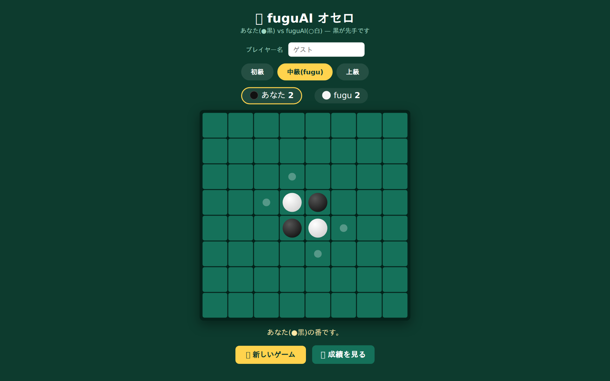

# fuguAI オセロ（`othello_fugu`）

fugu（Sakana AI のLLM）と対戦できるブラウザオセロ。難易度3段階・匿名成績記録付き。

- **本番URL**: https://othellofugu.afuku5906.com （SSL / HTTP→HTTPS強制）
- **姉妹アプリ**: [chess_fugu](../chess_fugu/)（同スタイルのチェス版）



## 技術スタック

PHP 8 / MySQL / JavaScript（vanilla）。プロトタイプは Python（Flask）で作成後、PHPへ移植。

## 設計の特徴 — サーバーサイド完結のルールエンジン

chess_fugu がルール処理をクライアント（chess.js）に置くのに対し、
オセロは **ルールエンジンを自作PHP（`othello.php`）でサーバー側に実装**。
着手の合法判定・反転処理・勝敗判定を全てサーバーで再計算するため、クライアント改ざんの影響を受けない。

| 難易度 | 思考エンジン（全てサーバー側） |
|---|---|
| 初級 | 合法手からランダム |
| 中級 | **fugu API**（盤面をテキスト描画してLLMに渡し着手を選択・失敗時フォールバック） |
| 上級 | **ミニマックス 深さ4**＋位置評価テーブル（角=120点、角の隣=マイナス評価） |

## 構成

```
othello_fugu/
├── index.php            盤面UI（8x8・合法手ヒント・スコア表示）
├── fugu_api.php         人間の着手適用→AI手番進行→盤面返却（パス処理含む）
├── othello.php          ルールエンジン（合法手・反転・minimax・評価関数）
├── config.php           DB接続・fugu APIキー取得
├── stats.php            通算・難易度別成績・ランキング
└── prototype_flask/     Python(Flask)プロトタイプ版（app.py / othello.py / fugu_ai.py）
```

## DB（匿名成績記録）

MySQL `othello_fugu` / games テーブルに難易度・勝敗・手順を記録。

## セキュリティ

- **APIキーをコードに置かない**: 環境変数 or webroot外 `/var/www/secrets/` から読み込み
- `config.php`（DB接続情報）はリポジトリ方針により公開対象から除外
- PDO プリペアドステートメント / サーバー側での合法手検証
